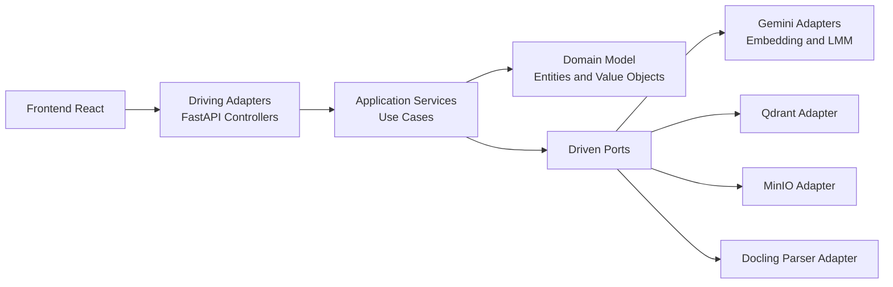
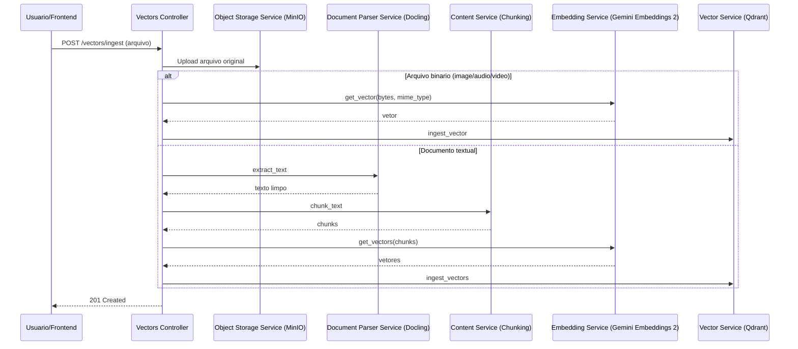
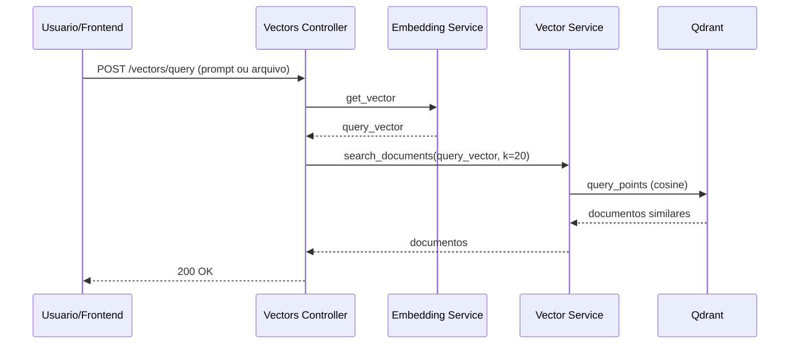
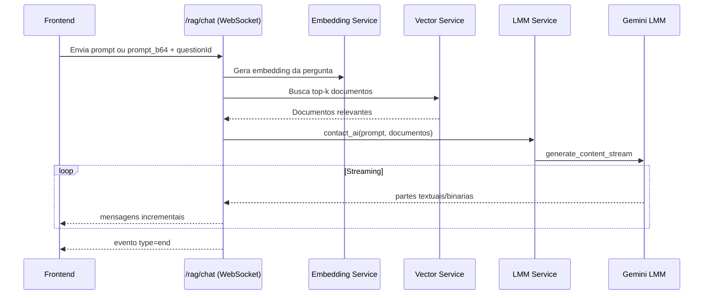
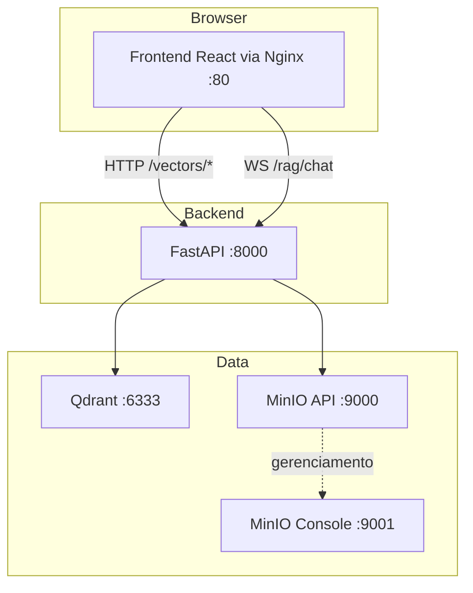

# `QueryRag` 🚀

Plataforma de `Retrieval-Augmented Generation` (`RAG`) multimodal para ingestao, indexacao vetorial e consulta inteligente de conteudo, com backend em `FastAPI`, armazenamento vetorial em `Qdrant`, armazenamento de objetos em `MinIO` e interface web em `React`.

<div align="center">
	<a href="#visao-geral">Visao Geral</a> •
	<a href="#recursos-principais">Recursos Principais</a> •
	<a href="#apis">APIs</a> •
	<a href="#arquitetura">Arquitetura</a> •
	<a href="#fluxos-rag">Fluxos RAG</a> •
	<a href="#tecnologias">Tecnologias</a> •
	<a href="#infraestrutura-local">Infraestrutura Local</a> •
	<a href="#instalacao-e-uso">Instalacao e Uso</a> •
	<a href="#configuracao-de-ambiente">Configuracao de Ambiente</a> •
	<a href="#principios-solid-aplicados">Principios SOLID Aplicados</a> •
	<a href="#estrutura-do-projeto">Estrutura do Projeto</a> •
	<a href="#debitos-tecnicos-e-melhorias">Debitos Tecnicos e Melhorias</a> •
	<a href="#contribuicao">Contribuicao</a>
</div>

---

<h2 id="visao-geral">Visao Geral ✨</h2>

O `QueryRag` foi construido para responder perguntas com base em documentos e arquivos ingeridos pelo sistema.

Neste projeto, os embeddings sao gerados com `Google Gemini Embeddings 2` (`gemini-embedding-2-preview`), o primeiro modelo de embeddings multimodal do Google: https://docs.cloud.google.com/vertex-ai/generative-ai/docs/models/gemini/embedding-2?hl=pt-br

O fluxo principal funciona assim:

1. 📤 Arquivos sao enviados para ingestao.
2. 🧩 O backend faz parsing/chunking quando necessario.
3. 🧠 Embeddings multimodais sao gerados com `Google Gemini Embeddings 2`.
4. 🗂️ Vetores e metadados sao persistidos no `Qdrant`.
5. 📦 Arquivos originais sao armazenados no `MinIO`.
6. 🔎 Consultas por texto/arquivo recuperam documentos relevantes.
7. 💬 O chat RAG responde via WebSocket com streaming.

---

<h2 id="recursos-principais">Recursos Principais 🧩</h2>

- 🧱 Ingestao de documentos com parser (`Docling`) e chunking semantico.
- 🎞️ Ingestao multimodal direta (imagem, audio, video) com embedding do arquivo inteiro via `Google Gemini Embeddings 2`.
- 🎯 Busca vetorial por similaridade cosseno no `Qdrant`.
- 💬 Chat `RAG` em streaming via `WebSocket`.
- 🎙️ Suporte a pergunta textual ou binaria (ex.: audio WebM convertido para WAV).
- 🧭 Frontend com 3 jornadas principais: Chat, Ingestao e Busca Vetorial.
- 🏗️ Arquitetura em camadas (dominio, aplicacao e infraestrutura) com portas e adaptadores.

---

<h2 id="apis">APIs 🔌</h2>

### Endpoints principais

| Metodo | Endpoint | Tipo | Descricao |
|---|---|---|---|
| POST | /vectors/ingest | HTTP | Faz upload de arquivo, gera embeddings e persiste vetores/metadados |
| POST | /vectors/query | HTTP | Consulta vetorial por prompt textual ou arquivo |
| WS | /rag/chat | WebSocket | Chat RAG com streaming de resposta |

### Documentacao da API

- Swagger UI: http://localhost:8000/docs
- ReDoc: http://localhost:8000/redoc

>ℹ️ Em `Docker Compose`, o backend e publicado na porta definida por `BACKEND_PORT` (padrao no exemplo: 8005).

---

<h2 id="arquitetura">Arquitetura 🏗️</h2>

O projeto segue uma abordagem de `Hexagonal Architecture`:

- `Dominio`: entidades, value objects, excecoes e contratos de dominio.
- `Aplicacao`: casos de uso/servicos que orquestram regra de negocio.
- `Infraestrutura`: adaptadores de entrada (controllers) e saida (`Gemini Embeddings 2` e `LMM`, `Qdrant`, `MinIO`, `Docling`).

### Diagrama de camadas



---

<h2 id="fluxos-rag">Fluxos RAG 🔄</h2>

### 1) Fluxo de ingestao



### 2) Fluxo de consulta vetorial



### 3) Fluxo de chat RAG com streaming



---

<h2 id="tecnologias">Tecnologias 🛠️</h2>

### Backend

- `Python 3.11`
- `FastAPI` + `Uvicorn`
- `Google Gemini API` (`Gemini Embeddings 2` para vetorizacao multimodal e `Gemini LMM` para geracao)
- `Docling` (extracao de texto)
- `Qdrant Client`
- `miniopy-async` (`MinIO`)
- `pydub` + `static-ffmpeg` (processamento de audio)

### Frontend

- `React 19` + `TypeScript`
- `Vite`
- `Tailwind CSS`
- `Radix UI` / `shadcn`
- `WebSocket` nativo

### Infra local

- `Docker` e `Docker Compose`
- `Qdrant`
- `MinIO`
- `Nginx` (servindo build do frontend)

---

<h2 id="infraestrutura-local">Infraestrutura Local 🧱</h2>



---

<h2 id="instalacao-e-uso">Instalacao e Uso 🚀</h2>

## Opcao 1: Executar tudo com Docker Compose (recomendado) 🐳

1. Copie o arquivo de ambiente do compose:

```bash
cp docker/env-example docker/.env
```

PowerShell:

```powershell
Copy-Item docker/env-example docker/.env
```

2. Ajuste as variaveis (principalmente `GEMINI_API_KEY`) em `docker/.env`.

3. Suba os servicos:

```bash
cd docker
docker compose up --build
```

4. Acesse:

- 🌐 `Frontend`: http://localhost:80
- 📘 `Backend Docs` (considerando `BACKEND_PORT=8005`): http://localhost:8005/docs
- 🪣 `MinIO Console`: http://localhost:9001

## Opcao 2: Executar em desenvolvimento (backend e frontend separados) 🧪

### Backend

```bash
cd backend
cp env-example .env
pip install -r requirements.txt
uvicorn app:app --host 0.0.0.0 --port 8000 --reload
```

PowerShell:

```powershell
cd backend
Copy-Item env-example .env
pip install -r requirements.txt
uvicorn app:app --host 0.0.0.0 --port 8000 --reload
```

### Frontend

```bash
cd frontend
cp env-example .env
npm install
npm run dev
```

PowerShell:

```powershell
cd frontend
Copy-Item env-example .env
npm install
npm run dev
```

Frontend padrao: http://localhost:5173

---

<h2 id="configuracao-de-ambiente">Configuracao de Ambiente ⚙️</h2>

### `Backend` (`backend/env-example`)

| Variavel | Descricao |
|---|---|
| `GEMINI_API_KEY` | Chave da API Gemini |
| `GEMINI_LMM_MODEL` | Modelo LMM (padrao no projeto: `gemini-2.5-flash`) |
| `GEMINI_EMBEDDING_MODEL` | Modelo de embedding (padrao no projeto: `gemini-embedding-2-preview`) |
| `QDRANT_HOST`, `QDRANT_PORT`, `QDRANT_COLLECTION` | Configuracao do `Qdrant` |
| `MINIO_HOST`, `MINIO_PORT`, `MINIO_CONSOLE_PORT` | Configuracao do `MinIO` |
| `MINIO_ACCESS_KEY`, `MINIO_SECRET_KEY`, `MINIO_BUCKET_NAME`, `MINIO_SECURE` | Credenciais e bucket do `MinIO` |
| `QUERY_RAG_FRONTEND_URL` | Origem permitida no `CORS` |
| `EMBEDDING_DIMENSION` | Dimensao do embedding (padrao 3072) |
| `CHUNK_LIST_MAX_LENGTH` | Limite maximo de chunks por documento |

Referencia do modelo de embedding usado neste projeto: `Gemini Embeddings 2` (primeiro modelo de embeddings multimodal do Google) - https://docs.cloud.google.com/vertex-ai/generative-ai/docs/models/gemini/embedding-2?hl=pt-br

### `Frontend` (`frontend/env-example`)

| Variavel | Descricao |
|---|---|
| `VITE_API_ENDPOINT` | Base URL HTTP do backend |
| `VITE_WS_CHAT_ENDPOINT` | URL `WebSocket` do chat |

---

<h2 id="principios-solid-aplicados">Principios SOLID Aplicados 🧱</h2>

O projeto segue `SOLID` de forma natural por meio da arquitetura hexagonal, das portas abstratas e de servicos com responsabilidades especificas.

- `S` - `Single Responsibility Principle`: cada servico tem uma responsabilidade clara, como `ContentService` para chunking, `DocumentParserService` para extracao, `EmbeddingService` para embeddings, `VectorService` para busca e persistencia vetorial, `ObjectStorageService` para objetos e `LmmService` para geracao de resposta.
- `O` - `Open/Closed Principle`: o comportamento pode ser estendido com novos adaptadores e provedores sem alterar os servicos de aplicacao, porque eles dependem de portas como `DocumentParser`, `EmbeddingModel`, `VectorRepository`, `ObjectStorageRepository` e `LmmModel`.
- `L` - `Liskov Substitution Principle`: qualquer implementacao concreta que respeite o contrato de uma porta pode substituir outra sem quebrar o fluxo da aplicacao, por exemplo um novo provedor de embeddings pode ser usado no lugar do atual desde que implemente `EmbeddingModel`.
- `I` - `Interface Segregation Principle`: as portas sao pequenas e especificas para cada caso de uso, evitando interfaces grandes e acopladas; por isso o projeto separa contratos como `ContentUseCase`, `DocumentParserUseCase`, `EmbeddingUseCase`, `VectorUseCase`, `ObjectStorageUseCase` e `LmmUseCase`.
- `D` - `Dependency Inversion Principle`: a camada de aplicacao depende de abstracoes, nao de implementacoes concretas, e os detalhes de infraestrutura entram por injeção via portas, como visto em `DocumentParserService`, `EmbeddingService` e nos demais servicos da aplicacao.

---

<h2 id="estrutura-do-projeto">Estrutura do Projeto 🗂️</h2>

```text
backend/
	application/
		services/
		ports/
		dto/
	domain/
		model/
		vo/
		ports/
		exceptions/
	infrastructure/
		adapters/
			driving/controllers/
			driven/
		config/
		utils/

frontend/
	src/
		pages/
		components/
		contexts/
		lib/
		types/
		config/

docker/
	docker-compose.yaml
	env-example
```

---

<h2 id="debitos-tecnicos-e-melhorias">Debitos Tecnicos e Melhorias 📌</h2>

- ⚠️ Reranking ainda nao implementado no fluxo de recuperacao (campo rerank_score permanece nulo).
- ℹ️ Estrategias de observabilidade (tracing distribuido e metricas de qualidade de recuperacao) podem ser expandidas. Atualmente a aplicação conta com logging canônico nos principais fluxos.
- 🧪 Pipeline de avaliacao automatica da qualidade das respostas RAG pode ser adicionada.
- 🔐 Implementação de autenticação/autorização.
- 🧩 Implementação de suporte para outros LLMs/Modelos de embedding multimodal via Strategy Pattern + Factory Pattern (Sentence Transformers SDK, OpenAI SDK, etc...).
- ✅ Implementação de testes unitários, integração e E2E.

---

<h2 id="contribuicao">Contribuicao 🤝</h2>

1. Crie uma branch a partir da main.
2. Implemente sua alteracao.
3. Execute validacoes locais:

```bash
# Backend
cd backend
python -m compileall .

# Frontend
cd ../frontend
npm run lint
npm run build
```

4. Abra um Pull Request com contexto tecnico da mudanca.

---

## Licenca 📄

Este projeto esta licenciado sob a MIT License. Veja o arquivo LICENSE.

